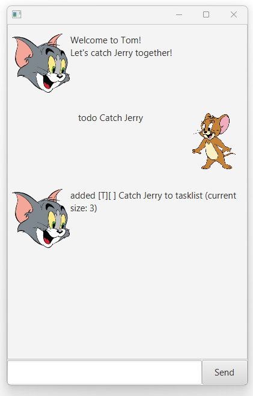
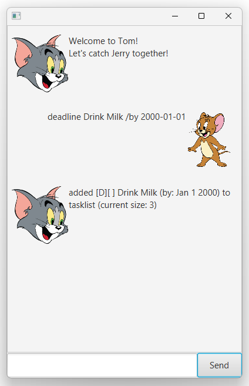
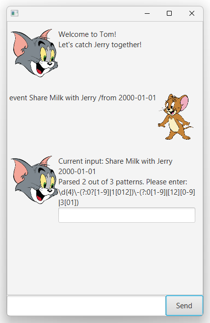
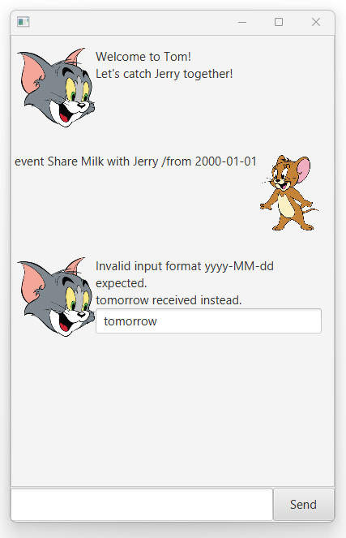
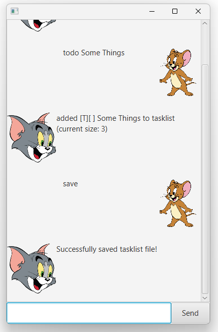
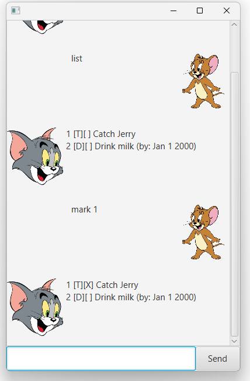
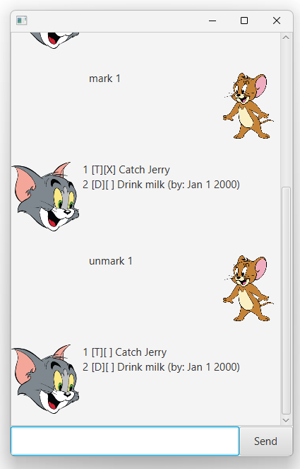
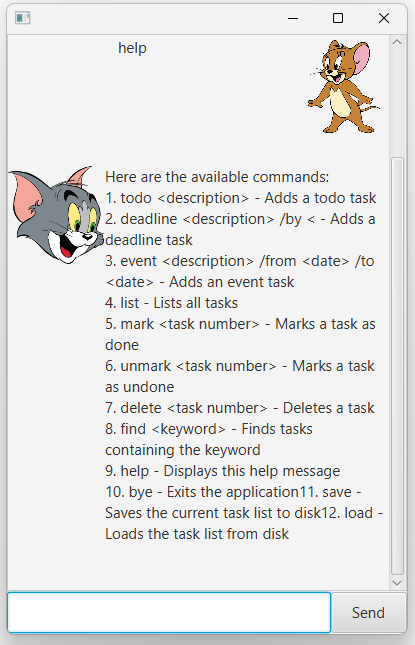
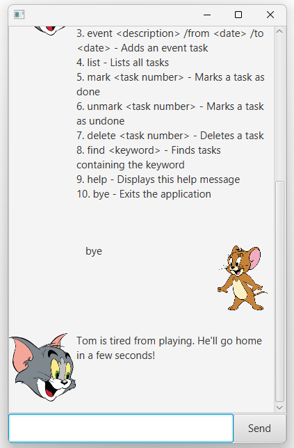

# Tom and Jerry User Guide

Welcome to Tom and Jerry's chat! 


This is our screenshot of the user interface. It provides a visual representation of how users can interact with the application to manage their tasks. The interface is designed to be intuitive and user-friendly, allowing users to easily add, edit, and track their tasks.

## Tasks

There are three types of tasks that Tom will keep track of.

### Task Descriptions

- **Todo**: A task that needs to be done but does not have a specific deadline.
- **Deadline**: A task that needs to be completed by a specific date and time.
- **Events**: A task that occurs at a specific date and time.

Each task type helps in organizing and prioritizing your activities effectively.

## Adding Tasks

### Interactive GUI

To add a deadline task, enter the `deadline` command.

Example: `deadline`

The GUI will automatically show up and ask for additional information required.


Fill up accordingly. The format is yyyy-MM-dd.


Errors are displayed as shown.


If there are no errors, this adds a task with the description "Drink Milk" and an end date of Jan 1, 2000. We can verify this with the list command.

```
[D][ ] Drink Milk (by: Jan 1 2000)
```

### CLI

Let's explore an alternative method with `todo` and `event` command.

Example: `todo Catch Jerry`



This will directly accept the description method with no further GUI prompting.

This can be done all task command too. Their formats are:
- `todo [description]`
- `deadline [description] /by [deadline]`
- `event [description] /from [start] /to [end]`


Therefore, we can add the deadline command above directly as such:




### Edge cases

Let's explore edge cases with an `event` command.

Example: `event Share Milk with Jerry /from 2000-01-01`



Then, both the [description] and [start] will be parsed. We only need to provide an additional [end] field in the input box.

Suppose we entered the wrong format in this input box.



Then, the GUI will inform us of the expected format.

## Saving Tasks

Tasks are automatically saved to disk whenever changes are made. On startup, Tom will load tasks from `data/tom.txt` if the file exists.

To manually save tasks, use the `save` command.

Example: `save`

This command ensures that all current tasks are written to `data/tom.txt`.

```
Tasks have been saved to disk.
```



This feature provides an additional layer of assurance that your tasks are securely stored.

### Saving tasks

Example: `save`

## List Tasks

### List Feature

The list feature allows users to view all the tasks that have been added to the application. This is useful for getting an overview of all pending and completed tasks.

To use the list feature, enter the `list` command.

Example: `list`

The application will display all tasks in the order they were added.

```
Here are the tasks in your list:
1. [T][ ] Catch Jerry
2. [D][ ] Drink Milk (by: Jan 1 2000)
3. [E][ ] Share Milk with Jerry (from: Jan 1 2000 to: Jan 2 2000)
```

This feature helps users keep track of their tasks and their statuses.

Refer to the GUI examples below.

## Mark/Unmark Tasks

### Mark/Unmark Feature

The mark/unmark feature allows users to mark tasks as completed or unmark them as not completed. This is useful for tracking the progress of tasks.

To mark a task as completed, enter the `mark` command followed by the task number.

Example: `mark 1`

```
Nice! I've marked this task as done:
[T][X] Catch Jerry
```



To unmark a task as not completed, enter the `unmark` command followed by the task number.

Example: `unmark 1`

```
OK, I've marked this task as not done yet:
[T][ ] Catch Jerry
```



This feature helps users update the status of their tasks easily.

## Delete Tasks

### Delete Feature

The delete feature allows users to remove tasks from the list. This is useful for managing tasks that are no longer needed.

To delete a task, enter the `delete` command followed by the task number.

Example: `delete 2`

```
Noted. I've removed this task:
[D][ ] Drink Milk (by: Jan 1 2000)
```


This feature helps users keep their task list clean and organized.

## Feautre Help

### Help Feature

The help feature provides users with a comprehensive guide on how to use the various commands available in the application. This feature is essential for new users who are unfamiliar with the command syntax and for experienced users who need a quick reference.

To access the help feature, enter the `help` command.

Example: `help`

The application will display a list of all available commands along with a brief description of each command.



This feature ensures that users have all the information they need to effectively use the application at their fingertips.

## Feature Find

### Find Task Feature

The find task feature allows users to search for tasks containing specific keywords. This is particularly useful when you have a long list of tasks and need to quickly locate a particular task.

To use the find feature, enter the `find` command followed by the keyword you are searching for.

Example: `find Drink`

The application will display all tasks that contain the keyword "Drink".

```
Here are the matching tasks in your list:
1. [D][ ] Drink Milk (by: Jan 1 2000)
```


This feature helps in efficiently managing and locating tasks without having to manually scroll through the entire list.

## Feature Bye

### Bye Feature

The bye feature allows users to exit the application gracefully. This command is essential for ensuring that all data is saved and the application is closed properly.

To use the bye feature, enter the `bye` command.

Example: `bye`

The application will save all current tasks and close the user interface.



This feature ensures that users can safely exit the application without losing any data.