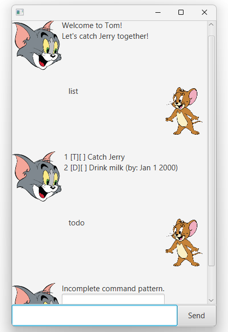

# Tom and Jerry User Guide

Welcome to Tom and Jerry's chat! 



This is our screenshot of the user interface. It provides a visual representation of how users can interact with the application to manage their tasks. The interface is designed to be intuitive and user-friendly, allowing users to easily add, edit, and track their tasks.

## Tasks

There are three types of tasks that Tom will keep track of.

### Task Descriptions

- **Todo**: A task that needs to be done but does not have a specific deadline.
- **Deadline**: A task that needs to be completed by a specific date and time.
- **Events**: A task that occurs at a specific date and time.

Each task type helps in organizing and prioritizing your activities effectively.

## Adding events

To add a deadline task, enter the `deadline` command.

Example: `deadline`

The GUI will automatically show up and ask for additional information required.


Fill up accordingly. The format is yyyy-MM-dd.


Errors are displayed as shown.


If there are no errors, this adds a task with the description "Drink Milk" and an end date of Jan 1, 2000. We can verify this with the list command.

```
[D][ ] Drink Milk (by: Jan 1 2000)
```

## Feature Find

### Find Task Feature

The find task feature allows users to search for tasks containing specific keywords. This is particularly useful when you have a long list of tasks and need to quickly locate a particular task.

To use the find feature, enter the `find` command followed by the keyword you are searching for.

Example: `find Drink`

The application will display all tasks that contain the keyword "Drink".

```
Here are the matching tasks in your list:
1. [D][ ] Drink Milk (by: Jan 1 2000)
```


This feature helps in efficiently managing and locating tasks without having to manually scroll through the entire list.